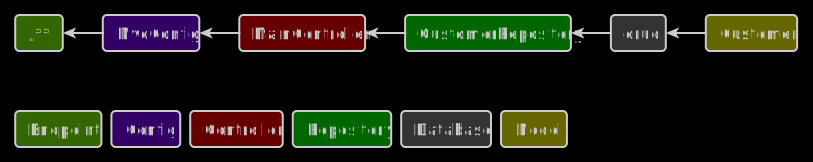

# CRUD

## Description
A simple CRUD application. The index page displays a list of customers with names and emails.

## Used tools
* Platform: Spring Boot 2.6.1
* Builder: Gradle 7.2
* Databases: PostgreSQL 14.1
* Languages: Java SE 8u311, HTML5, CSS3
* Dependencies: Spring Data JPA, Thymeleaf, Validation, Spring Web, Selenium, Lombok, PostgreSQL Driver

## Important files
* Builder configuration: /build.gradle
* Application properties: /src/main/resources/application.properties

## Frontend and backend schema

## Installation
1. Create crud database in PostgreSQL
2. Install ChromeDriver (chromedriver.exe) in C:/Program Files/ChromeDriver or enter your path
in /src/test/java/web/crud/controller/MainControllerTest.java
3. Run this project in a development environment
4. Open http://localhost:8080 in the browser

## Release notes
* Project type: Web application
* Date of release: 14 December 2021
* Date of last update: 28 June 2023
* Current version: 2.2
